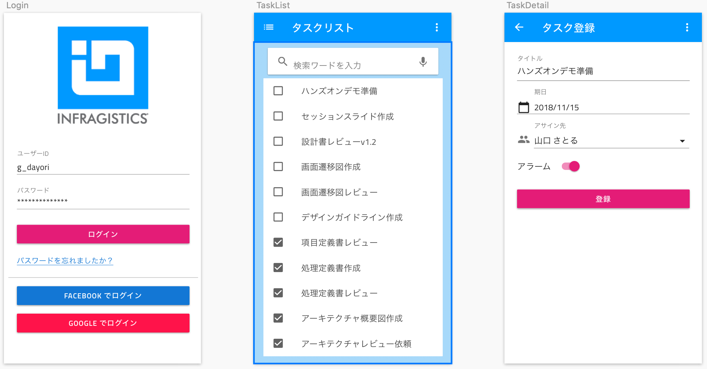

# Indigo.Design ハンズオン

## 本ハンズオンについて

本ハンズオンは、Indigo.Design が提供するツールやプラグインを活用して、デザイン ～ プロトタイプ ～ コード生成 の一連の流れを体験するためのものです。お題に沿って手順を進めていくと簡単なタスク管理アプリのデザインとプロトタイピングを体験できます。ハンズオンを進めるためには [こちらの環境要件](docs/00-環境準備.md) が必要となるのでご注意ください。

## お題について

簡単なタスク管理アプリをデザインしていきます。ログイン、リスト表示、詳細表示/登録の３つの画面をデザイン～プロトタイプします。

[完成予想のプロトタイプ](https://cloud.indigo.design/share/p5r2v5k97az9){:target="_blank"}

## Indigo.Design について

Indigo.Design は、ビジュアルデザイン、プロトタイピング、コード生成、アプリケーション開発のためのプラットフォームです。デザイン => プロトタイピング =>コード生成 の３ステップをそれぞれ支援するプラグインやツール群を提供し、UXの向上とデザインに忠実なアプリケーション開発を短期間で実現できます。

[Indigo.Design 概要ビデオ](https://static.infragistics.com/marketing/Website/products/indigo-design/indigo-design-tour.jpg)

[Indigo.Design Web サイト](https://jp.infragistics.com/products/indigo-design)

## 目次
0. [環境準備](docs/00-環境準備.md)
1. [IndigoDesignライブラリのインポート](docs/01-IndigoDesignライブラリのインポート.md)
2. [新規アートボードの作成とUIキットの利用](docs/02-新規アートボードの作成とUIキットの利用.md)
3. [ログイン画面のデザイン](docs/03-ログイン画面のデザイン.md)
4. [リスト画面のデザイン](docs/04-リスト画面のデザイン.md)
5. [登録画面のデザイン](docs/05-登録画面のデザイン.md)
6. [デザインの共有とプロトタイピング](docs/06-デザインの共有とプロトタイピング.md)
7. [プロトタイプの管理と評価](docs/07-プロトタイプの管理と評価.md)
8. [ユーザテストの作成と実施](docs/08-ユーザテストの作成と実施.md)
9. [コードの生成](docs/09-コードの生成.md)