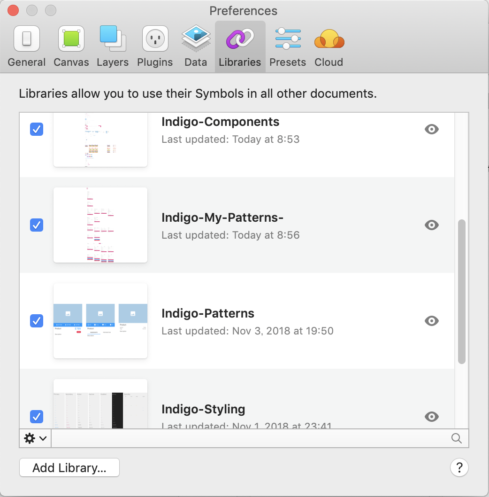

# Indigo.Design ライブラリ の入手とインポート

Sketch向けのデザインリソースとして、Indigo.Design Sketch UIキットを提供しています。

UIキットには、50種類以上のIndigo.Design Sketch UIコンポーネントが入っており、それぞれがアプリケーション開発時に利用できるAngularコンポーネントにマッピングされているため、これらを使って画面デザインを行うことで、HTML、CSS、Angularコードが出力できるようになります。

## 手順
UIキットはWebサイト上に公開されておりますので、通常であればそこからダウンロードしてSketchへインポートしますが、本ハンズオンではバージョン差異によるハンズオンコンテンツとの不整合を防ぐために、[当リポジトリ内にアップロードされているライブラリ](../libraries) を利用します。

※ githubからライブラリのみのダウンロードはできないので、[こちら](https://filetransfer.infragistics.com/public.php?service=files&t=67b4d87aa762985fe26e0b5545558d58) にライブラリのみをZip化ものが置いてあります。

ダウンロードができたら、4つの.sketchファイルをSketch上で追加します。

## 関連リソース

Sketch UI キットをダウンロードし、Sketchへインポートする方法は以下の動画で確認できます。

[ビデオチュートリアル - Sketch UI キットのインストール](https://www.youtube.com/watch?v=dfAXbGwJ07s&feature=youtu.be)

## Next

[02-新規アートボードの作成とUIキットの利用](02-新規アートボードの作成とUIキットの利用.md)
