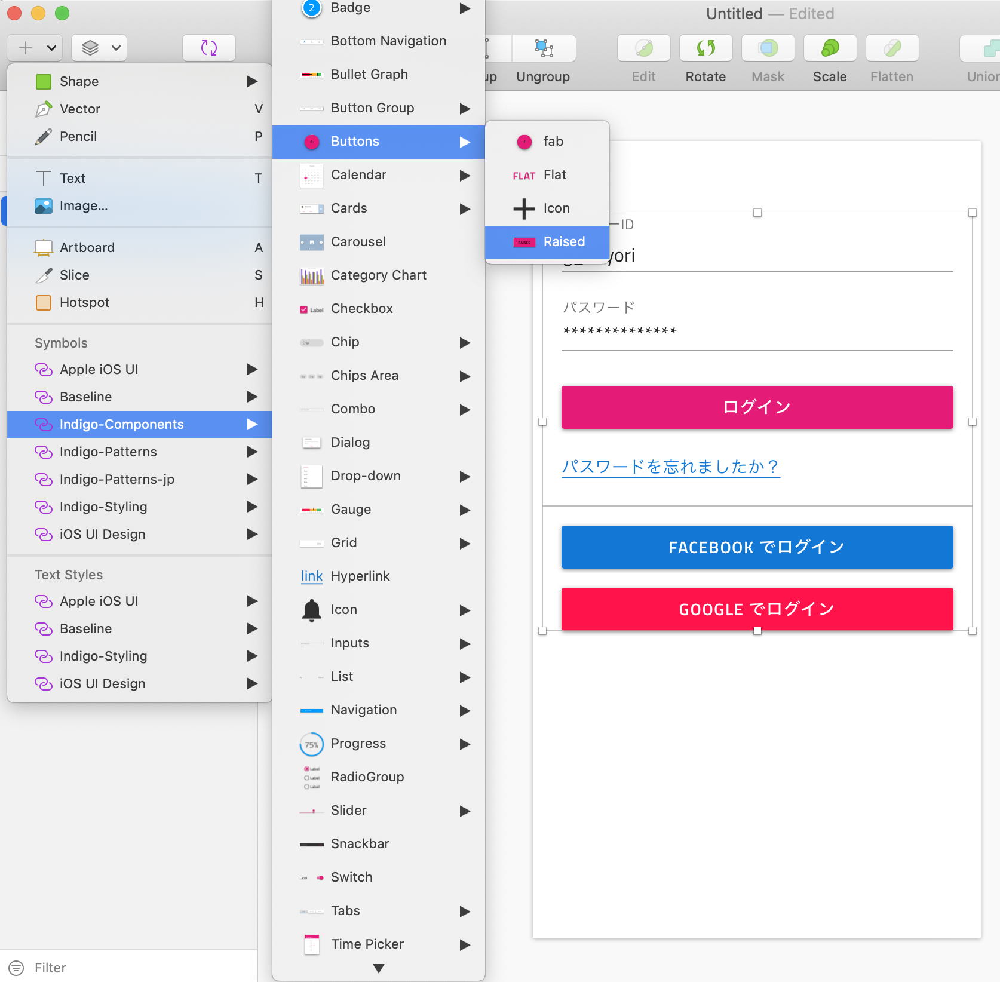

# Indigo.Design ライブラリ の入手とインポート

Sketch向けのデザインリソースとして、Indigo.Design Sketch UIキットを提供しています。

UIキットには、50種類以上のIndigo.Design Sketch UIコンポーネントが入っており、それぞれがアプリケーション開発時に利用できるAngularコンポーネントにマッピングされているため、これらを使って画面デザインを行うことで、HTML、CSS、Angularコードが出力できるようになります。

## 手順
UIキットはWebサイト上に公開されておりますので、通常であればそこからダウンロードしてSketchへインポートしますが、このハンズオンではバージョン差異によるハンズオンコンテンツとの不整合を防ぐために、当リポジトリ内にアップロードされているライブラリを利用します。

本ハンズオン向けのUIキットの場所 
[https://jp.infragistics.com/products/ignite-ui-angular/getting-started#tab-ignite-ui-cli](https://jp.infragistics.com/products/ignite-ui-angular/getting-started#tab-ignite-ui-cli)

ダウンロードができたら、4つの.sketchファイルをSketch上で追加します。

## 補足

Sketch UI キットをダウンロードし、Sketchへインポートする方法は以下の動画で確認できます。

[ビデオチュートリアル - Sketch UI キットのインストール](https://www.youtube.com/watch?v=dfAXbGwJ07s&feature=youtu.be)

## Next

[02-Componentの追加](02-Componentの追加.md)
