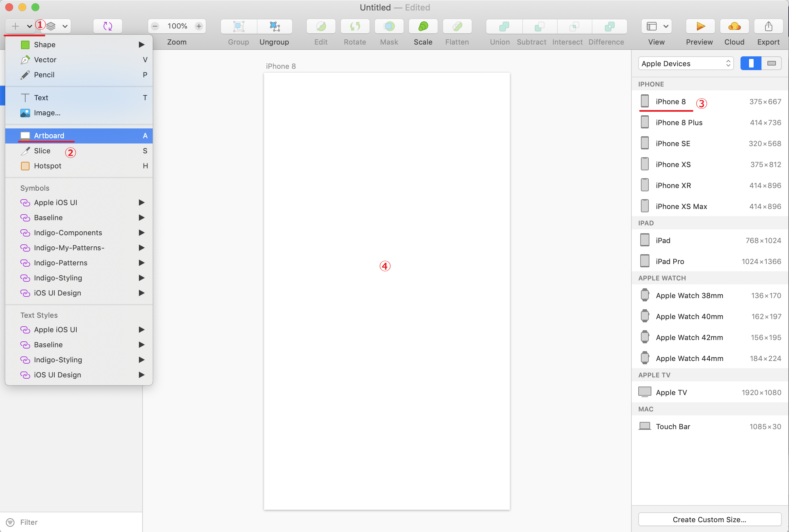
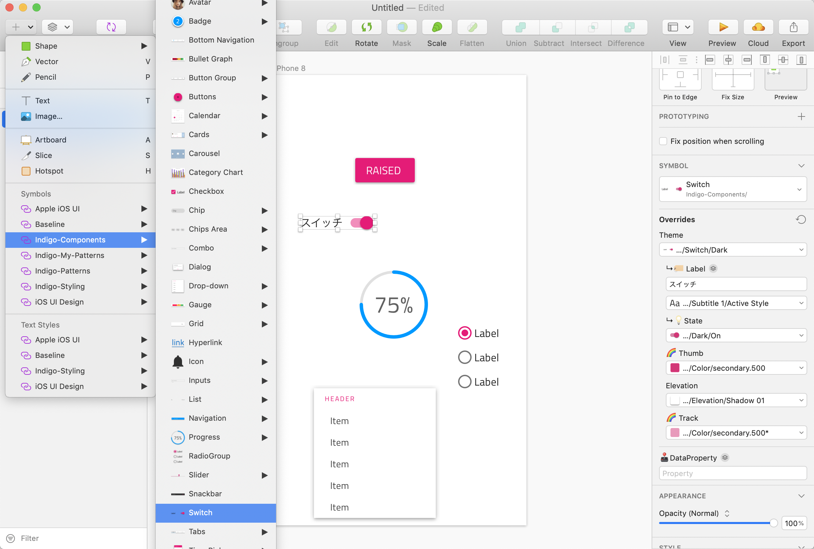

# 新規アートボードの作成とUIキットの利用

Sketch上で新規アートボードを作成し、UIキットのIndigo-Componentsに収録されているコンポーネントを幾つか配置して、どのようにデザインが行えるのか確認しましょう。

## 手順

1. 新規アートボードの作成
2. UIキットの利用

## 1 新規アートボードの作成

Sketchで新規ドキュメントを開き、新しいアートボードを iPhone8 のサイズで追加します。

## 2 UIキットの利用

IndigoComponentsやIndigoPatternsからButtonやSwitchなどいくつかコンポーネントを配置し、プロパティで表示ラベルなど変更してみましょう。

## 補足

## Next

[03-ログイン画面のデザイン](03-ログイン画面のデザイン.md)
