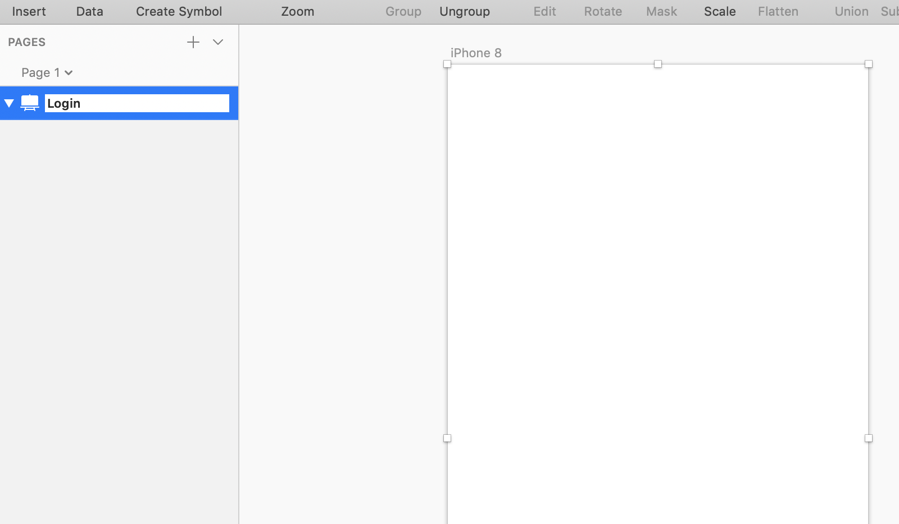
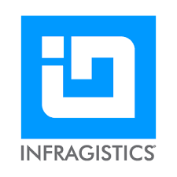
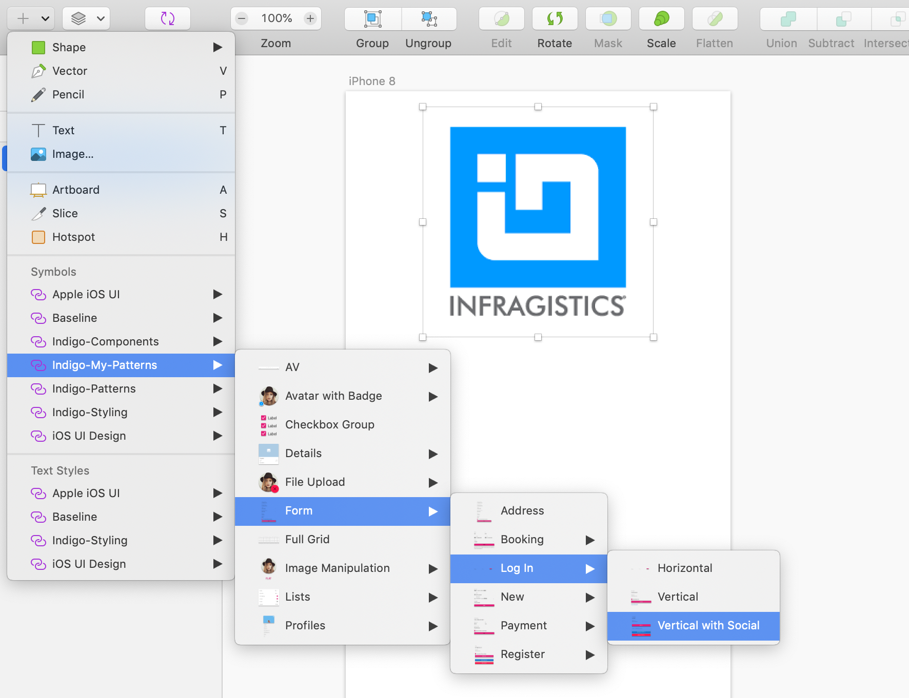
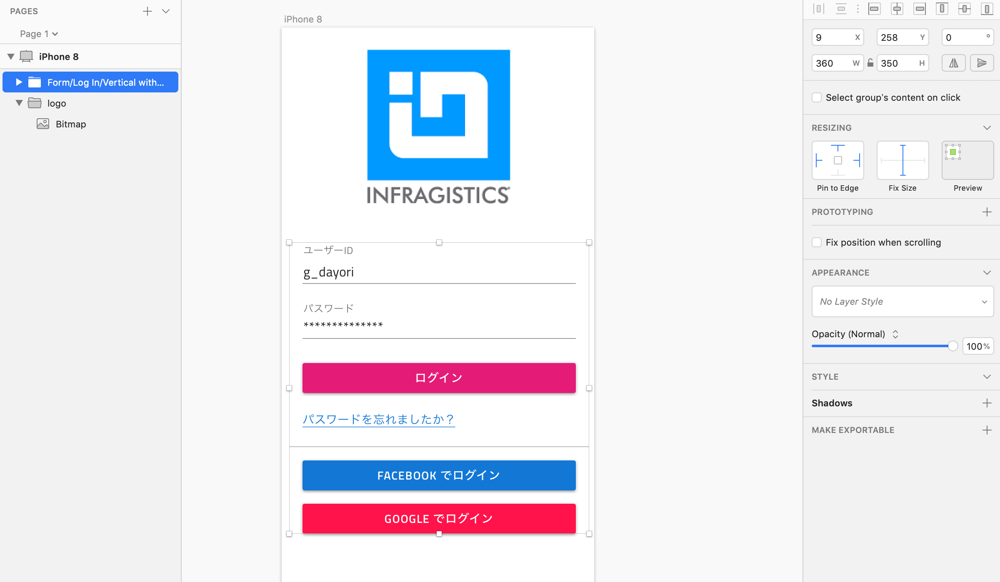
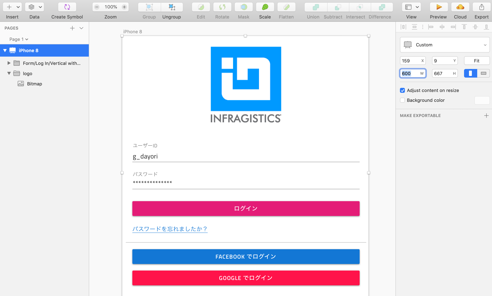

# ログイン画面のデザイン

タスク管理アプリのログイン画面をデザインします。

## 手順

1. アートボードの準備
2. 画像の配置
3. UIパターンの利用

## 1 アートボードの準備
前のステップで作成したアートボードを引き続き利用します。
配置した要素を一度すべて削除し、アートボードの名前をLoginに設定します。

## 2 画像の配置

ログイン画面の上部に画像を配置します。今回は下のInfragisticsロゴを右クリックでコピーし、アートボード上に貼り付けます。

更に、レスポンシブデザインに対応するため、またコード生成時に正しくレイアウトを維持するために、グループ化設定とリサイジングに関する設定を行います。

まずは画像をグループ化し、logoというグループ名を付けます。

続いて、今回は画像の横幅と高さを固定させたいので、縦横それぞれFIXに設定します。

## 3 UI パターンの利用

ログイン画面のコンテンツをIndigo-Components を使って一からデザインすることもできますがデザインに時間がかかります。こういった頻出UIパターンはIndigo-Patternsに含まれているため、登録されているパターンセットを利用することで、より早くデザインを行うことができます。

今回は事前にハンズオン向けに「Indigo-Patterns」をカスタマイズした「Indigo-My-Patterns」を利用します。

Indigo-My-Patterns > Form > Log In > Vertical with Social を選択し、ロゴの下に配置します。

続いて、配置したパターンを右クリックし、「Detach from Symbol」を行います。 
※Indigo-Componentsの各要素はそのままシンボルとして利用することができますが、Indigo-Patternsの各要素は最終的にコード生成するためには、「Detach from Symbol」が必要となります。

Detachを行うと、配置したパターンがグループ化された要素の塊となるので、そこに対してレスポンシブに横幅が変わるようにリサイジング設定を行います。

## 補足 - レイアウト設定の結果確認

ログイン画面のデザインが終わったら、リサイジングの設定がどのようにレイアウトに影響しているか確認してみましょう。

アートボードを選択した状態で、「Adjust content on resize」にチェックがついている状態で、横幅を600pxに変更してみます。正しくレイアウト設定できていれば、ロゴはサイズ固定で各入力要素やボタンは横幅が伸びていることが確認できます。

このように正しくレイアウトしておくことで、コード生成されたアプリケーションもサイズ固定ではなくレスポンシブにレイアウトされるようになります。

## Next

[02-Componentの追加](02-Componentの追加.md)
