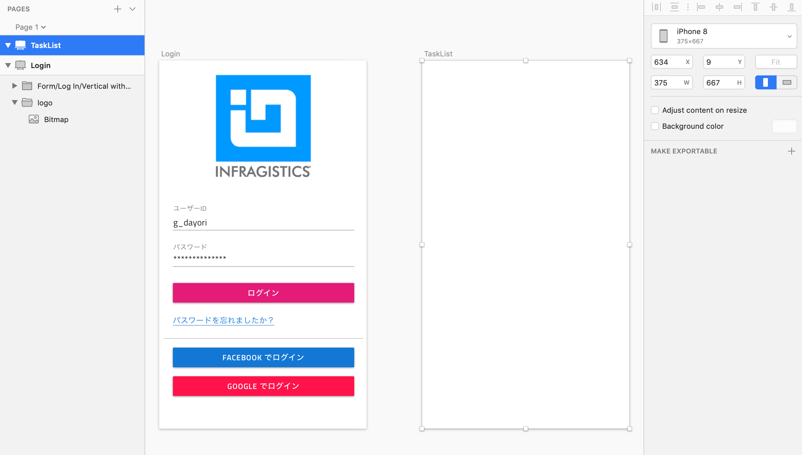
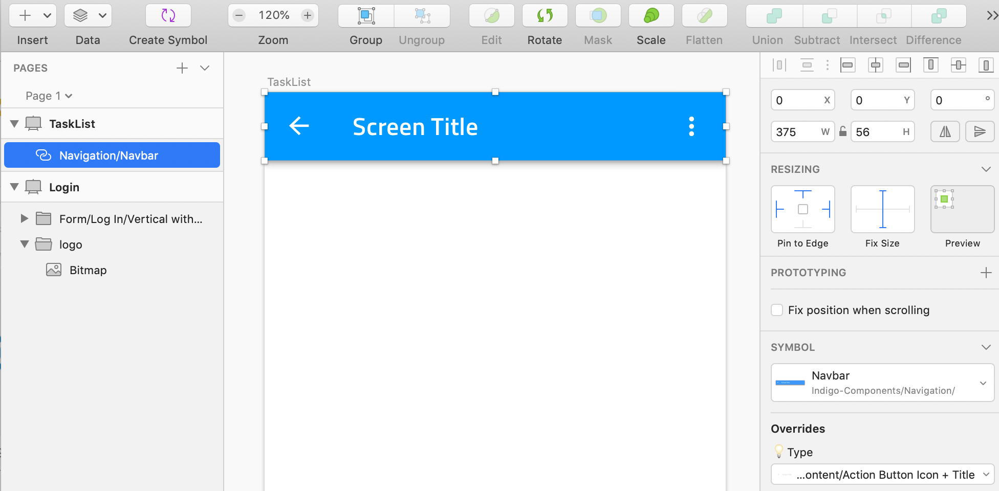
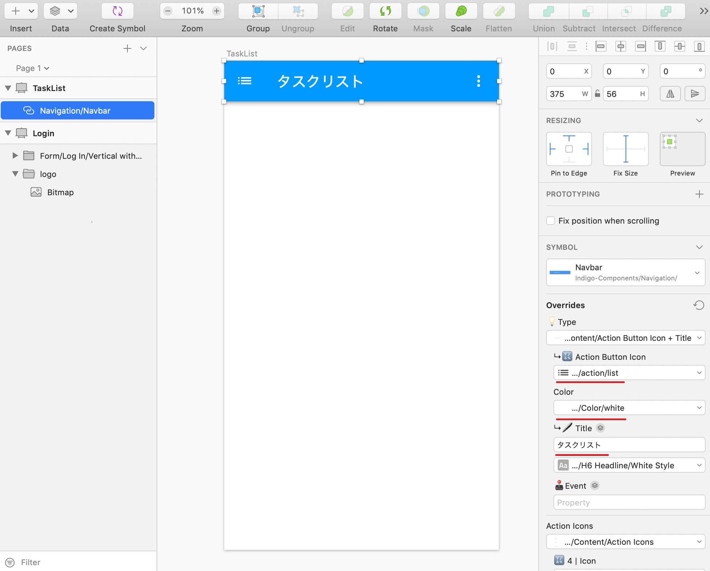
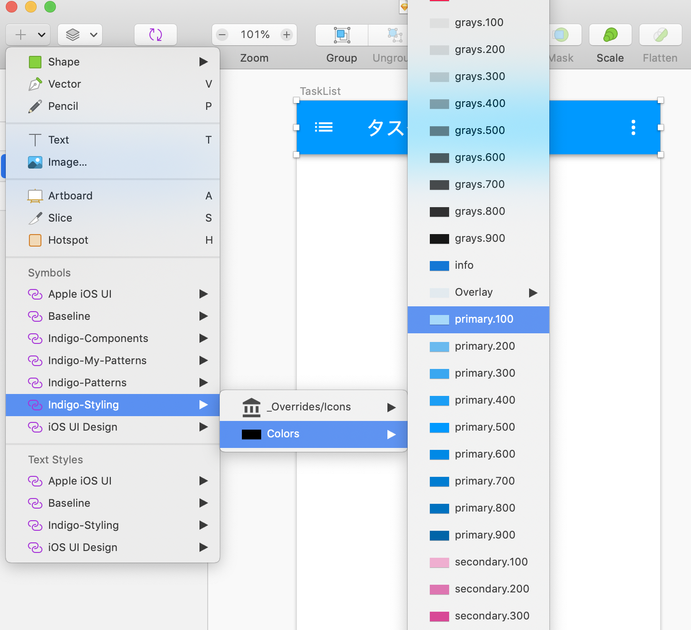
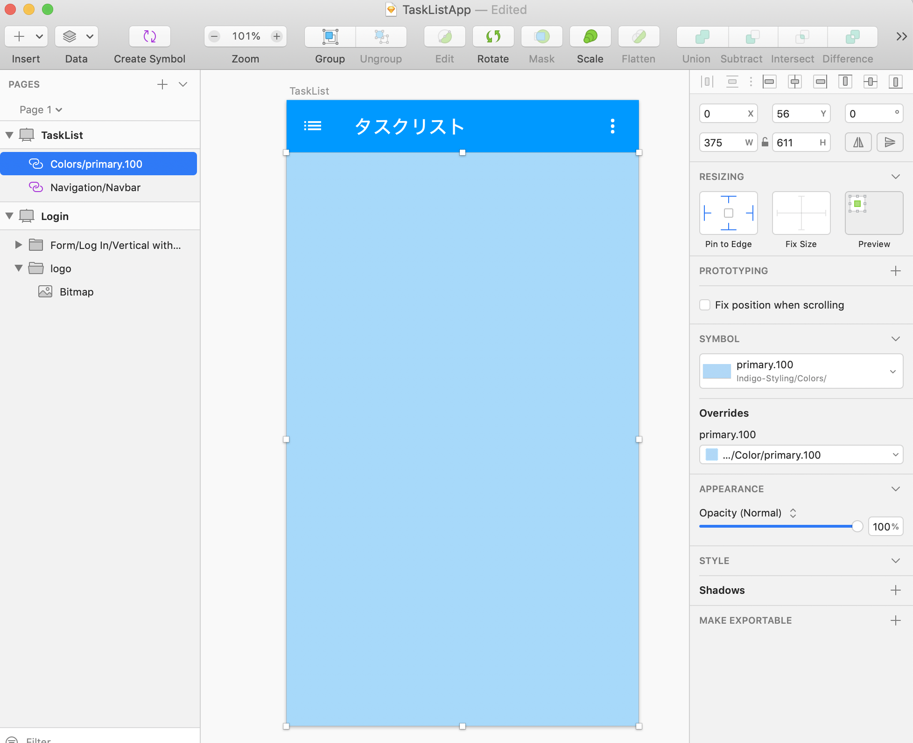
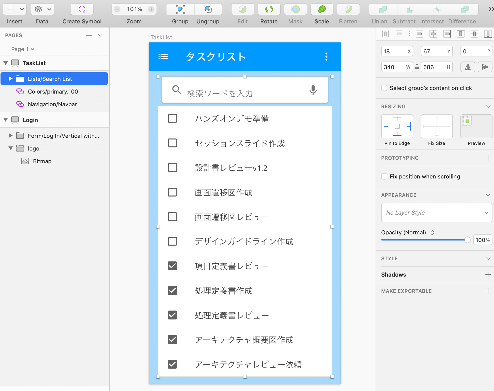
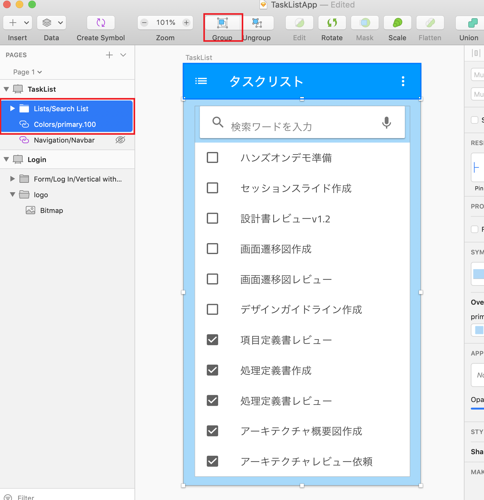
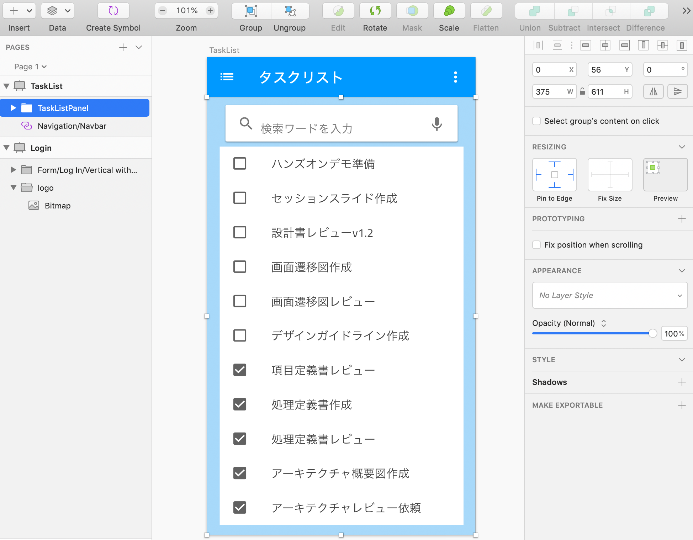

# リスト画面のデザイン

タスク管理アプリのタスクの一覧をリスト形式で表示する画面をデザインします。

## 手順

1. アートボードの準備
2. ナビゲーションバーの配置と設定
3. コンテンツ領域のデザイン

## 1 アートボードの準備
新たにアートボード（iPhone8）を追加し、TaskListと名前を付けます。

## 2 ナビゲーションバーの配置と設定

Indigo-Components > Navigation > Navbar を選択し、画面上部に配置します。続いて、横幅が可変となるようリサイジング設定します。

続いて、アイコンやタイトルを変更します。

Sketch画面右部のインスペクタ（要素に対して色々な設定が行えるところ）上で、titleに"タスクリスト"を、Action Icon ButtonにはIndigo-Styling > Overrides/Icons/action/listを、最後にAction Icon Button の下のColorにIndigo-Styling > Color > Whiteを設定します。

## 3 コンテンツ領域のデザイン

まずはコンテンツ領域の背景色を設定します。

Indigo-Styling > Colors > primary.100 を選択し、コンテンツ領域いっぱいに配置します。

縦横ともに可変となるようリサイジング設定を行います。

続いて、Indigo-My-Patterns > Lists > Search Listを配置し、「Detach from Symbol」とリサイジング設定を行います。

コンテンツ領域の背景色と配置したリストグループを選択し、グループ化します。コンテンツ領域を一つのグループとして定義しておくことで、この部分をコード生成時に１つのコンポーネントとして生成できるようになります。

最後に、作成したグループをTaskListPanelにリネームし、縦横が可変となるようリサイジング設定します。

## Next

[05-登録画面のデザイン](05-登録画面のデザイン.md)
