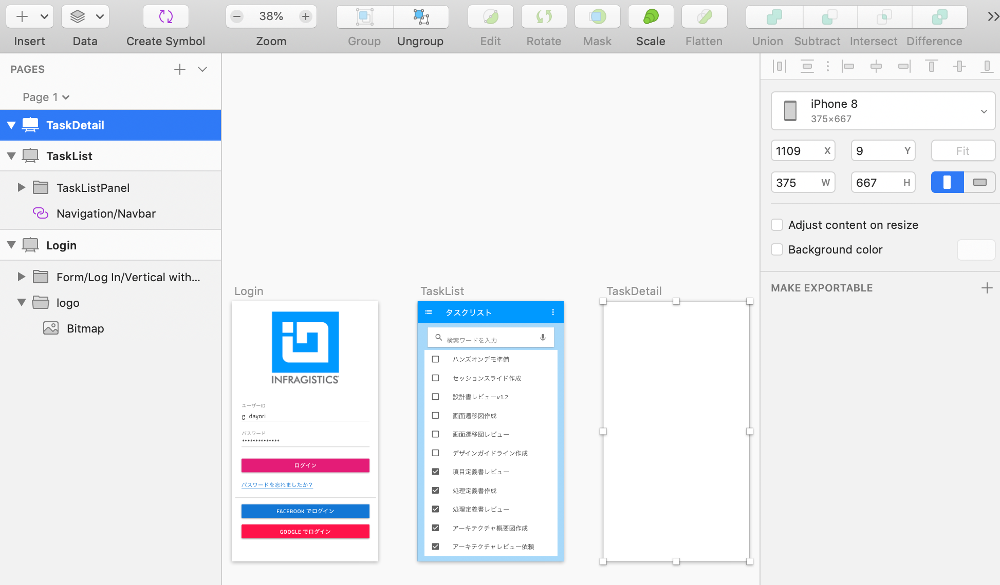
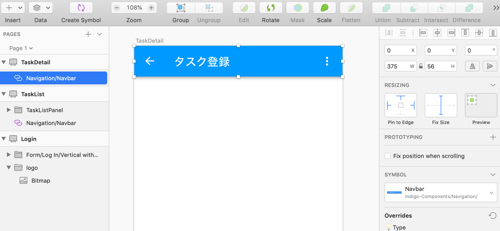
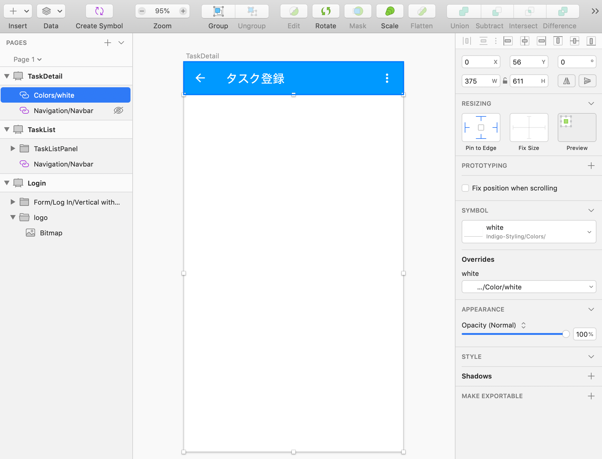
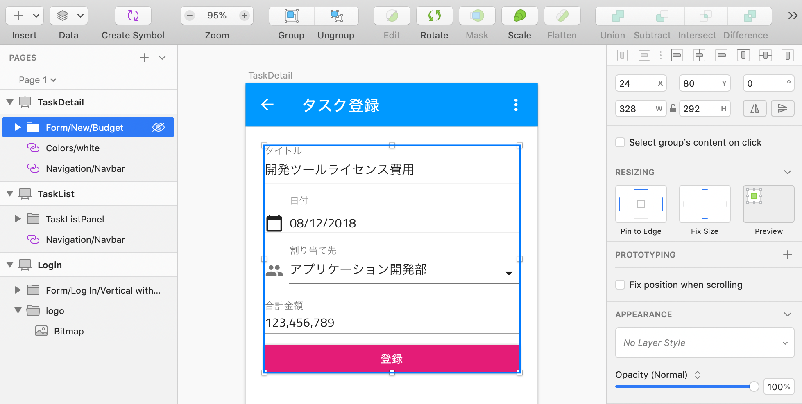
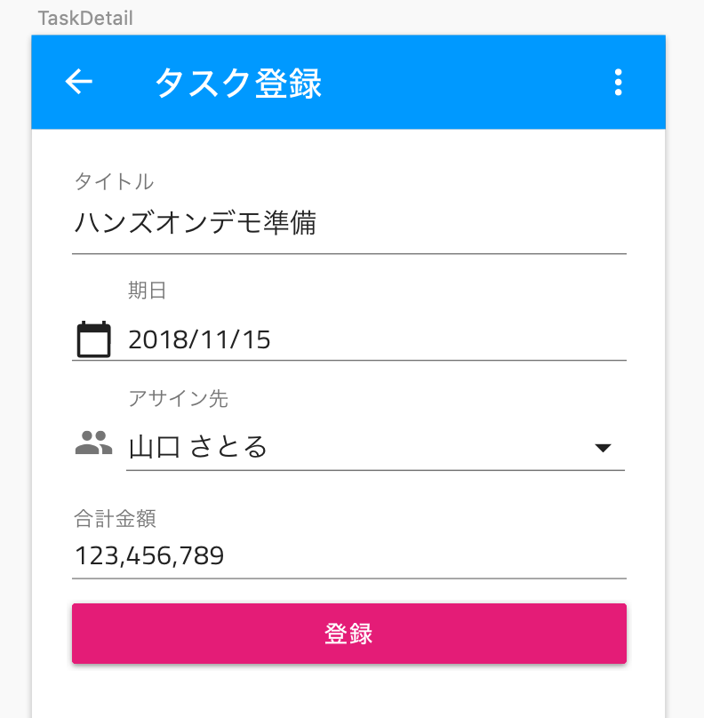
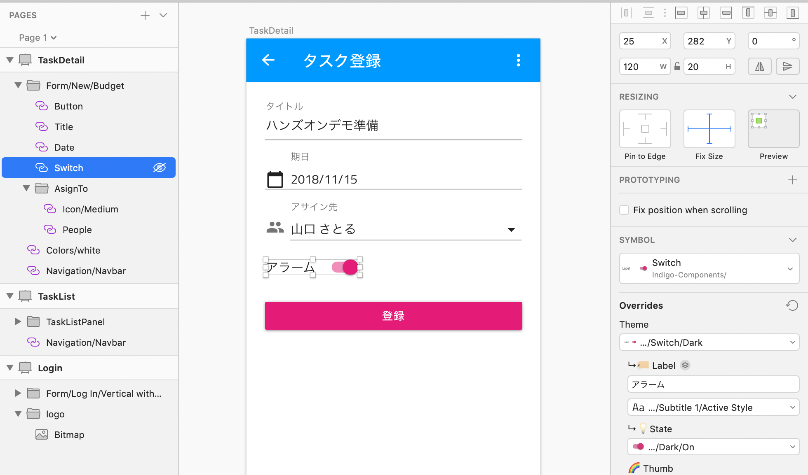
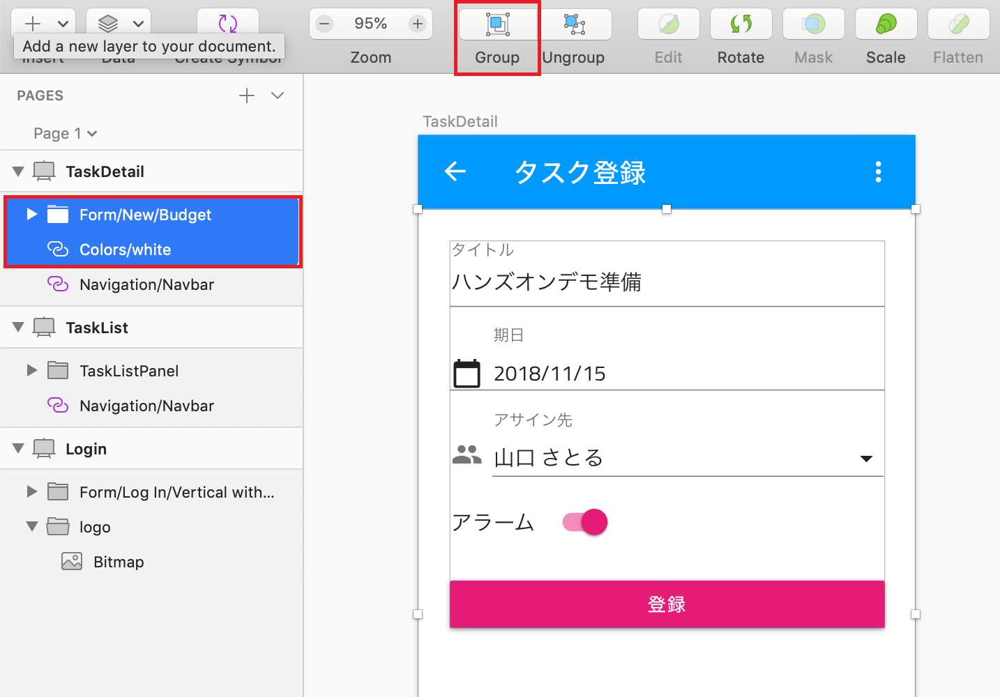

# 登録画面のデザイン

タスク管理アプリのタスクの詳細確認や登録するための画面をデザインします。

## 手順

1. アートボードの準備
2. ナビゲーションバーの配置と設定
3. コンテンツ領域のデザイン

## 1 アートボードの準備
新たにアートボード（iPhone8）を追加し、TaskDetailと名前を付けます。

## 2 ナビゲーションバーの配置と設定

リスト画面のデザインと同じ要領で、Indigo-Components > Navigation > Navbar を選択し、画面上部に配置します。続いて、横幅が可変となるようリサイジング設定します。また、インスペクタ上でtitleに"タスク登録"を設定します。

## 3 コンテンツ領域のデザイン

まずはコンテンツ領域の背景色を設定します。

Indigo-Styling > Colors > White を選択し、コンテンツ領域いっぱいに配置し、縦横ともに可変となるようリサイジング設定を行います。 ※見た目は白の背景を置いても変わりませんが、コード生成時にコンテンツ領域を１つのコンポーネントとして定義させるためにこの背景要素をベースとしたグループ化が必要となります。

続いて、Indigo-My-Patterns > Form > New > Budjet を配置し、「Detach from Symbol」とリサイジング設定を行います。

中のコンテンツが簡易的な予算入力のための要素となっているため、いくつか変更を加えていきます。

- Title
  - Input Textに"ハンズオンデモ準備"を設定
- Date
  - Labelに"期日"を設定
- Asign To > People
  - Labelに"アサイン先"を設定
  - Input Textに自分の名前を設定

続いて、合計金額(Amount)を削除し、代わりにIndigo-Components > Switch を追加し、Labelを"アラーム"に設定します。この時Switchが、TitleやDateなどの要素と同じ階層に配置されているか確認し、同じ階層にいない場合はレイヤーリスト上でドラッグ＆ドロップで同じ階層になるよう設定します。

リスト画面の時と同じ要領で、コンテンツ領域の背景色と配置したフォーム要素のグループを選択し、グループ化します。

最後に、作成したグループをTaskDetailPanelにリネームし、縦横が可変となるようリサイジング設定します。

ここまでで、タスク管理アプリのデザインが完了しました。

## 補足

## Next

[02-Componentの追加](02-Componentの追加.md)
