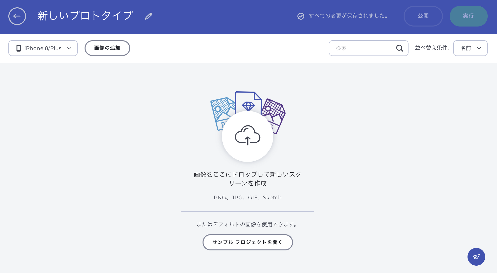
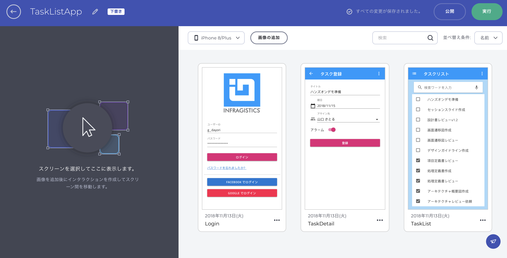
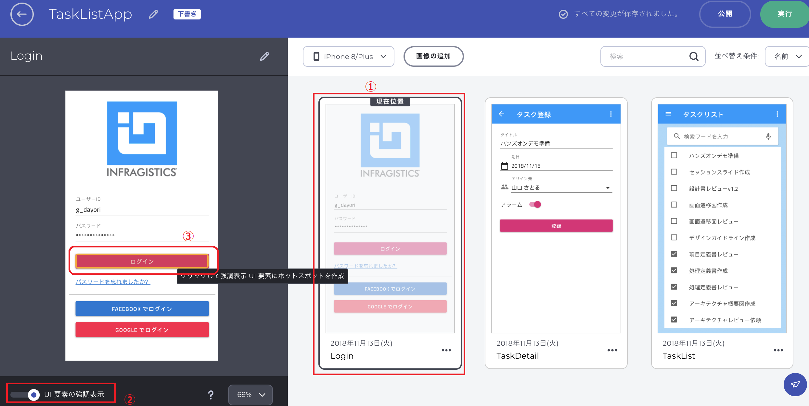
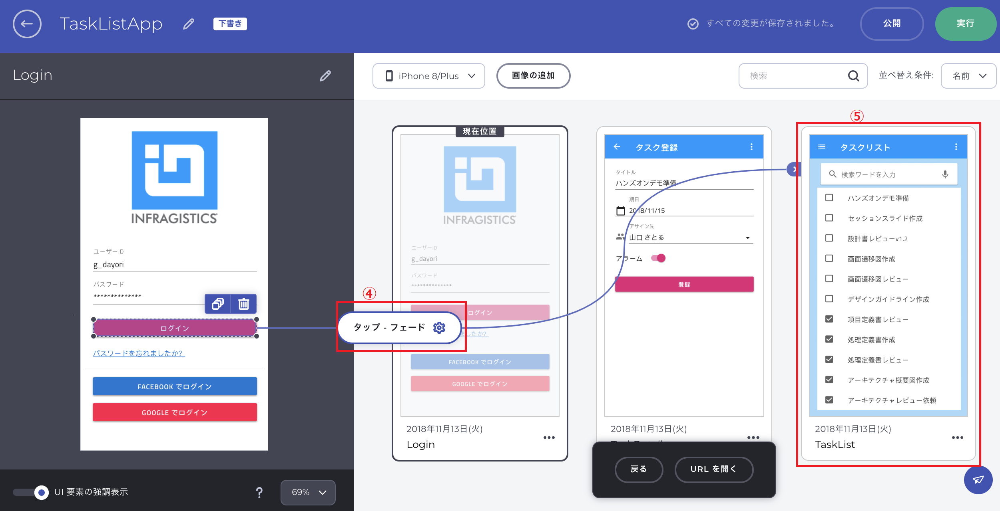
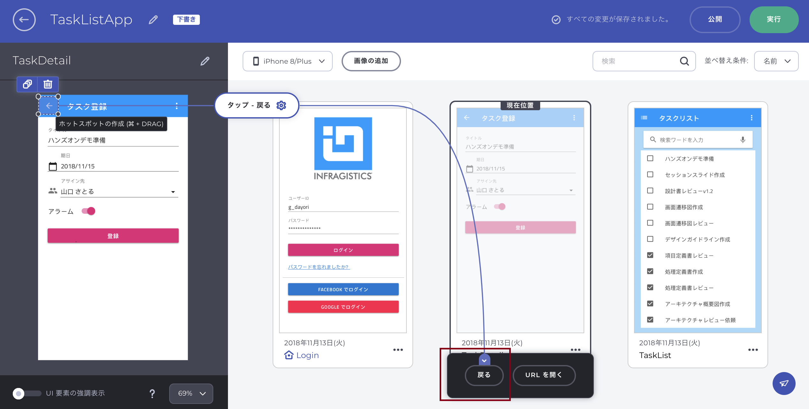
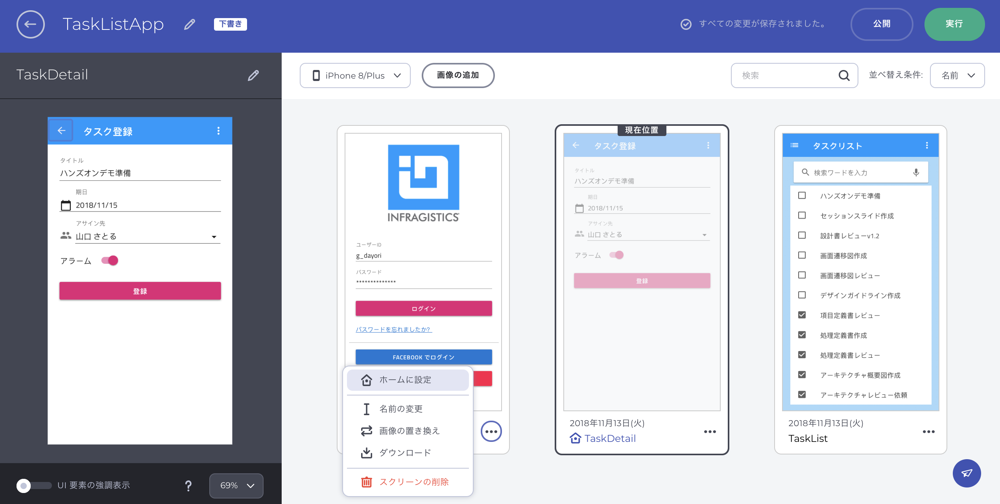
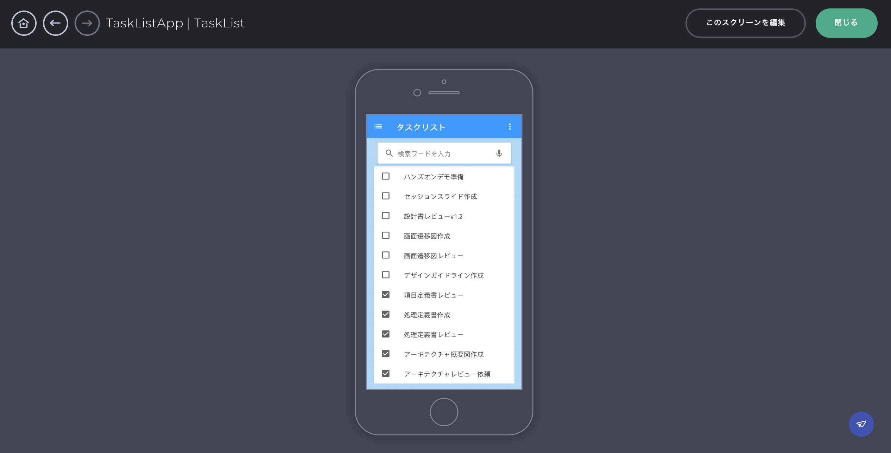
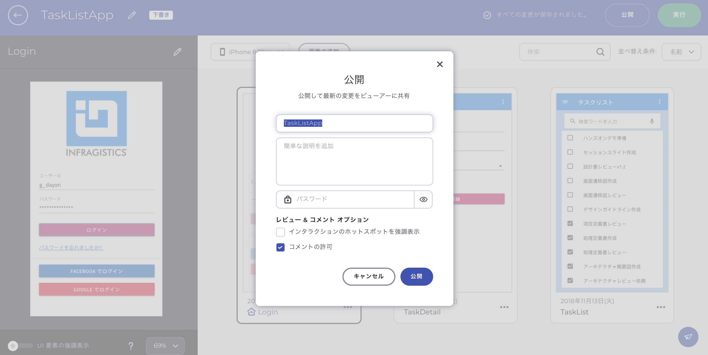
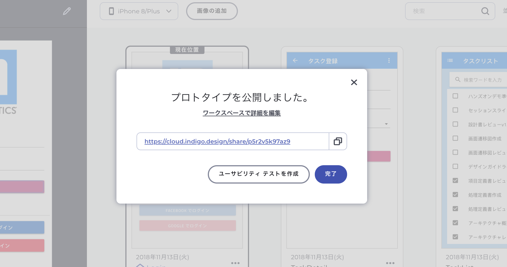

# デザインの共有とプロトタイピング

Sketchで作成されたデザインをクラウドサービス上にアップロードし、プロトタイピングを行います。

注意１：Sketch向けにIndigo.Design Syncプラグインという数クリックでデザインをクラウドへ共有できる仕組みが提供されておりますが、2018/11/13日時点で一部問題があるため本ハンズオンではプラグインを利用しない方法で進めます。

注意２：Sketch自体にプロトタイピング機能が用意されておりますが、そこで定義されたスクリーンフローもクラウドへ一緒に取り込まれます。そのためSketch自体のプロトタイピング機能を利用してもよいのですが、本ハンズオンではクラウド上でプロトタイピングを行います。

## 手順

1. デザインのアップロード
2. プロトタイピング
3. プロトタイプの確認
4. プロトタイプの公開

## 1 デザインのアップロード

以下のリンクよりIndigo.Designのクラウドサービスへアクセスしてください。※ログインが必要となります。また、トライアル期間内であれば、サブスクリプションは不要です。

[https://cloud.indigo.design/home](https://cloud.indigo.design/home)

アクセスしたら（＋）アイコンよりプロトタイプの作成を行います。以下の画面が開いたらデザインしたSketchファイルをドロップしてください。

全てのデザインが取り込めたら、画面左上のタイトルをTaskListAppに変更します。

## 2 プロトタイピング

アップロードされたデザインに対してスクリーン間の遷移を追加していきます。

まずはLoginを選択すると画面左側に選択したLoginのデザインが表示されます。画面下部の「UI要素の強調表示」をオンにして、ログインボタンを選択します。

続いて、「タップ - フェード」をクリックし、遷移先のTaskListを選択します。

同じ要領で、TaskListのリストアイテム「ハンズオンデモ作成」からTaskDetailへと繋ぎます。遷移時のトランジションを変更するために、「タップ - フェード」をクリックし、トランジションの設定ウィンドウを表示します。ここでは、左方向へのプッシュ型のトランジションを選択します。

同じ要領で、TaskDetailのナビゲーションバー上の戻るアイコンから「戻る」アイコンへ繋ぎます。「戻る」を選択すると、元居た画面へ遷移時と逆方向のトランジション効果を伴って画面遷移します。

最後に、Loginをホームに設定し、プロトタイピング完了となります。

## 3 プロトタイプの確認

作成したプロトタイプの動きを確認します。画面右上の実行ボタンより、プロトタイプを実行します。

## 3 プロトタイプの公開

作成したプロトタイプを公開します。画面右上の公開ボタンよりプロトタイプを公開します。この際、パスワードを付加するなどいくつかオプションを選択できます。

公開されるとURLが発行されるので、このリンクをチームメンバーや顧客へ共有し、デザインや遷移について確認・フィードバックを入れていく流れとなります。実際にリンクをクリックして、ブラウザ上で動きを確認してみましょう！

## 関連リソース

- オンラインヘルプ
  - [最初のプロトタイプを作成](https://jp.infragistics.com/products/indigo-design/help/prototyping/creating-a-prototype.html)
  - [インタラクション オプション](https://jp.infragistics.com/products/indigo-design/help/prototyping/interaction-options.html)

## Next

[07-プロトタイプの管理と評価](07-プロトタイプの管理と評価.md)
