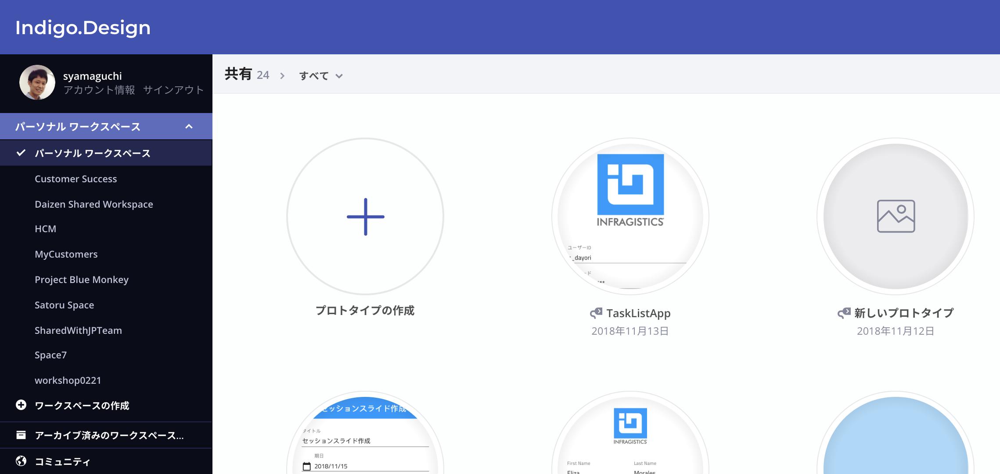
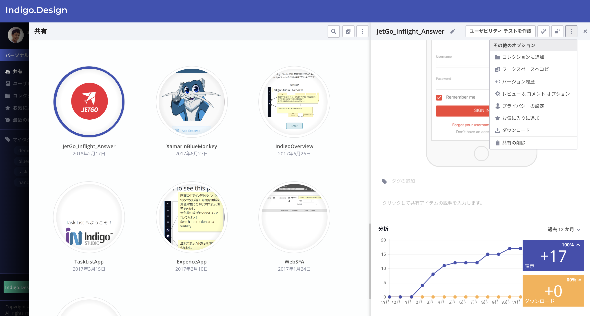
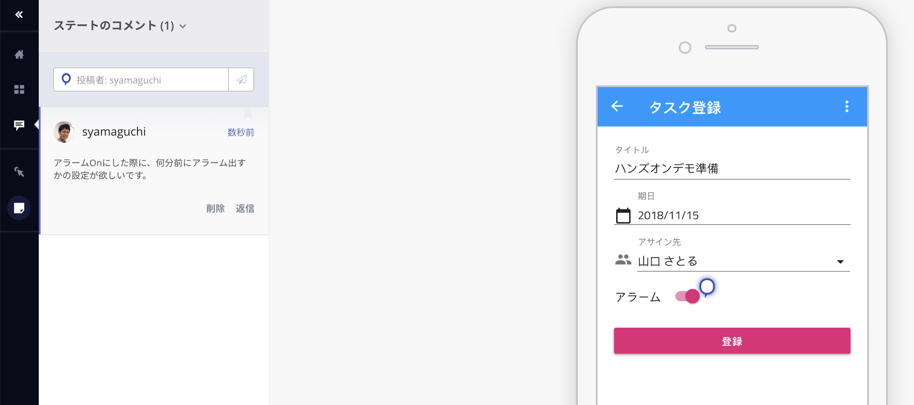

# プロトタイプの管理とコメント

アップロードしたプロトタイプを管理していくための仕組みがいくつか用意されています。どのような管理機能があるのか実際に触ってみましょう。

## 手順

1. ワークスペースの管理
2. その他、管理機能
3. コメント機能

## 1 ワークスペースの管理

ワークスペースを活用することで、プロトタイプをプロジェクトやチーム毎に管理・共同作業を行っていくことができます。初期状態ではパーソナルワークスペースのみが用意されていますが、新たなワークスペースを作成し、そこへチームメンバーを招待して共同作業していくことができるようになっています。

オンラインヘルプの [ワークスペースを使用したコラボレーション](https://jp.infragistics.com/products/indigo-design/help/prototyping/workspaces.html) を参考に、新しいワークスペースを作成してみましょう。

## 2 その他、管理機能

管理画面でアップロードしたプロトタイプを選択すると、画面右側に選択したプロトタイプの詳細管理を行うためのペインが現れます。ここで、アクセス履歴の確認、バージョン管理、コメントの通知制御など様々な管理設定を行うことができます。先ほどアップロードしたプロトタイプを選択して、管理オプションを幾つか触ってみましょう。

## 3 コメント機能

公開したプロトタイプに対してコメントを付加できます。アップロードしたプロトタイプを実行し、コメントをつけてみましょう。

## 関連リソース

- オンラインヘルプ
  - [コメントでアイデアを交換](https://jp.infragistics.com/products/indigo-design/help/prototyping/commenting.html)

## Next

[02-Componentの追加](02-Componentの追加.md)
