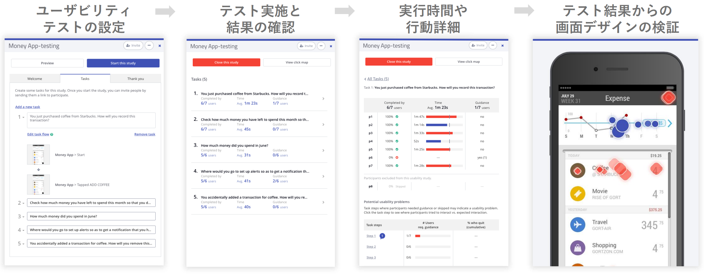
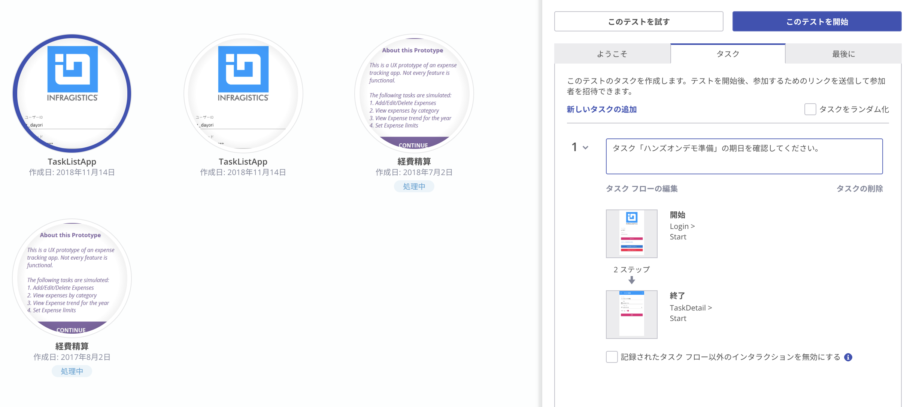
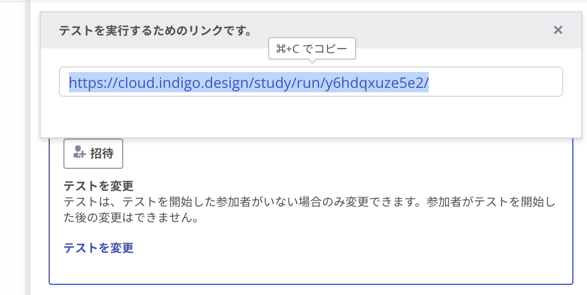
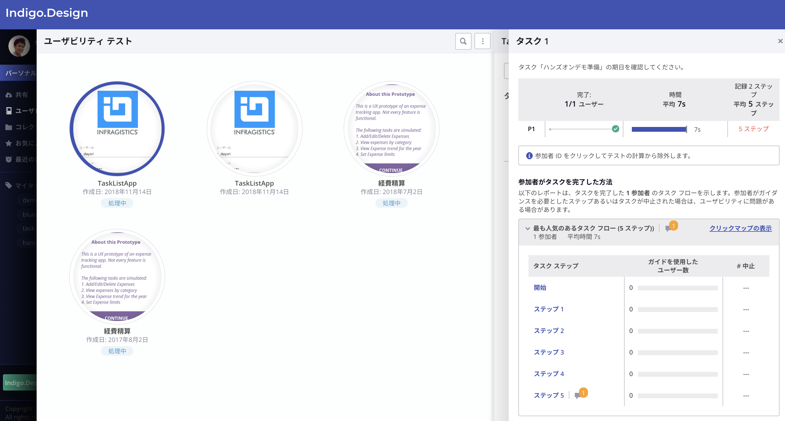

# ユーザテストの作成と実施

作成したプロトタイプに対して、シナリオと期待する操作と遷移を予め記録しておき、被験者へそのシナリオに沿って操作してもらう事で、
- どのぐらいの割合の被験者が想定する操作を行えたか
- どのぐらいの時間で操作完了しているか
- どの画面での操作で躓きやすいか、操作に迷いやすいか
- どんな表情で操作しているか、どこでストレスを感じているか

などを確認することができます。ユーザテストは、ユーザが操作している様を隣で事細かに観察する必要があり時間とコストがかかりがちですが、Indigo.Designのユーザテストの仕組みを利用することで時間とコストをあまりかけずに実施することができます。

## 手順

1. ユーザテストの作成
2. ユーザテストへの参加
3. テスト結果の確認

## 1 ユーザテストの作成

オンラインヘルプの [ユーサビリティ テストの作成](https://jp.infragistics.com/products/indigo-design/help/prototyping/setting-up-a-usability-study.html) を参考に、新規のテストを作成してみましょう。

※ 今回作成した簡単なプロトタイプでは、ユーザテストを行う意味はあまり無いですが、操作を覚えるためのステップとして新規テストを作成してみましょう。（もっと画面遷移や一つの画面の中での状態が多い、または操作に迷いやすいUIが多い場合に効果が高いです。）

## 2 テストの実施と参加

「このテストを開始」をクリックしてテストを開始できます。「招待」をクリックすると、URIを取得できるので、このリンクからユーザテストへ参加できます。

※ テストに参加する際にGoogle Chromeを利用している場合は、Chromeの拡張機能を利用することでテスト中の表情や操作しているマウスの動きをレコーディングすることができます。

## 2 テスト結果の確認

オンラインヘルプの [ユーサビリティ テスト結果の概要](https://jp.infragistics.com/products/indigo-design/help/prototyping/usability-study-results-overview.html) を参考に、テストの結果を確認してみましょう。

## Next

[02-Componentの追加](02-Componentの追加.md)
