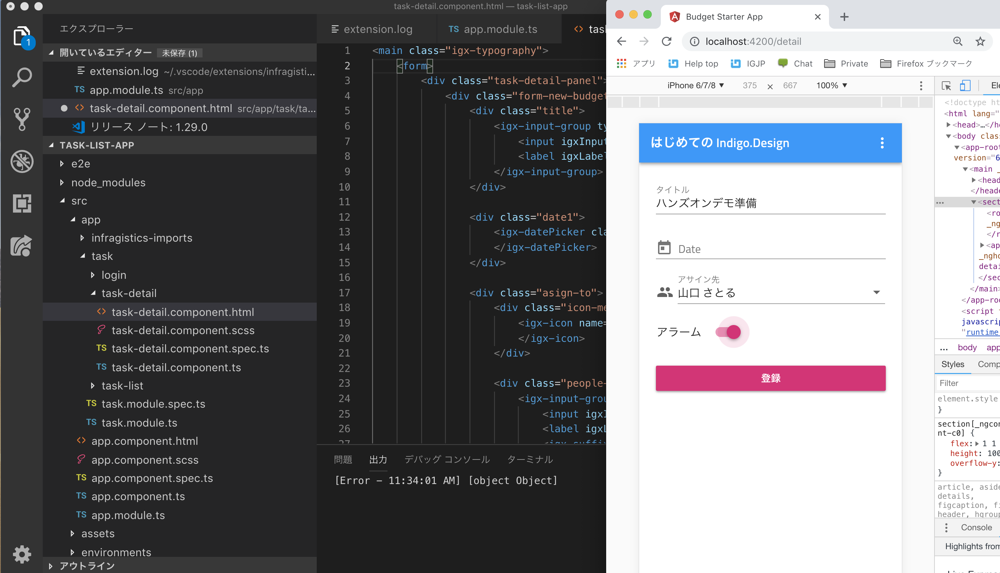

# コードの生成

ここまでの流れの中で、デザインを作成し、更にプロトタイピングでデザインやフローの妥当性を確認してきました。Indigo.Designでは更にそのデザインをコードへ落とし込むことができます。

このハンズオンコンテンツはSketchユーザを対象としたものとなっているため開発フェーズのハンズオンまでは行いませんが、興味のある方で開発環境を用意できる場合は、以下のオンラインリソースに沿ってコード生成も体験してみてください。

## 関連リソース

- ビデオチュートリアル
  - [コードの生成](https://jp.infragistics.com/products/indigo-design/help/video-tutorials.html)
- オンラインヘルプ
  - [Visual Studio Code 拡張機能のインストール](https://jp.infragistics.com/products/indigo-design/help/codegen/installing-vs-code-extension.html)
  - [VS Code の Indigo.Design コード ジェネレーター](https://jp.infragistics.com/products/indigo-design/help/codegen/vscode-plugin.html)
  - [コード生成後の手順](https://jp.infragistics.com/products/indigo-design/help/codegen/after-codegen.html)
  - [レイアウトの生成](https://jp.infragistics.com/products/indigo-design/help/codegen/layout-codegen.html)